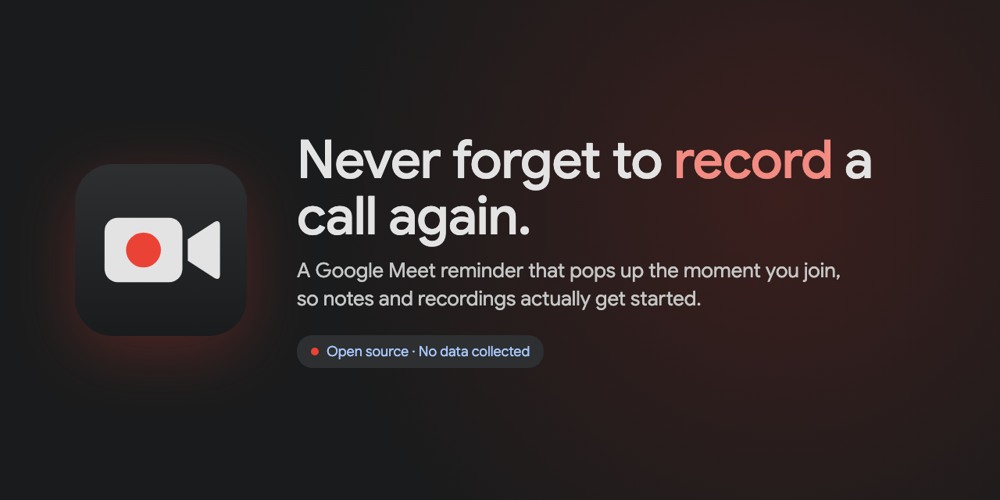
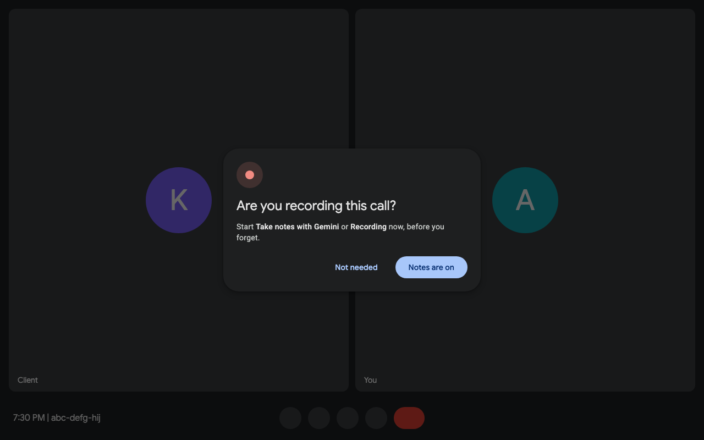

<p align="center">
  
</p>

<p align="center">
  <a href="LICENSE"></a>
  
  
</p>

# Meet Record Reminder

A tiny Chrome extension that pops up a clear **"Are you recording this call?"** reminder the moment you join a Google Meet call.

We built it after a client call went unrecorded. Google Meet can't switch on notes for every kind of meeting, like calls booked from a booking page, so this makes forgetting hard.

<p align="center">
  
</p>

## Features

- **Shows up at the right moment.** It waits until you are actually in the call, not on the lobby screen.
- **Once per meeting.** Dismiss it with **Notes are on** or **Not needed**.
- **Looks like Meet.** It uses the same dark dialog style as Meet's own popups.
- **Private.** It only runs on `meet.google.com`, stores nothing and sends nothing.
- **Tiny.** Plain JS and CSS. No build step, no dependencies.

## Install

**From source (now)**

1. Clone this repo.
2. Open `chrome://extensions`.
3. Turn on **Developer mode** (top right).
4. Click **Load unpacked** and pick the repo folder.
5. Join any Meet call to see it.

**Chrome Web Store:** coming soon.

## How it works

`content.js` checks the page once a second. When the URL is a meeting code (`abc-defg-hij`) and Meet's **Leave call** button is on screen, you're in the call, and the reminder shows. If your Meet UI isn't in English, it falls back to Meet's hang-up icon.

If Google changes Meet's UI and the reminder stops showing, please [open an issue](https://github.com/devmonks-co/meet-record-reminder/issues).

## Development

```sh
./build.sh   # zips the extension into dist/ for the Chrome Web Store
```

The store graphics in `assets/` are rendered from the HTML in `assets/src/`.

## Privacy

No data is collected. See [PRIVACY.md](PRIVACY.md).

## License

[MIT](LICENSE). Made by [devmonks](https://github.com/devmonks-co).
